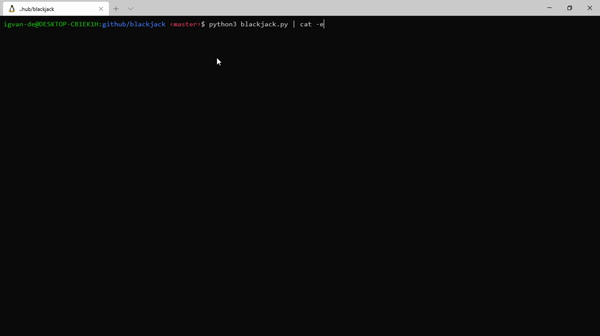

# blackjack

Is my first program programming in Python3.
The goal of the blackjack is to win from the dealer by get the highest total but under the value of 21.

# usage
 run the folling command to play a game of blackjack against the computer in your terminal:
  - python2 blackjack.py
  

